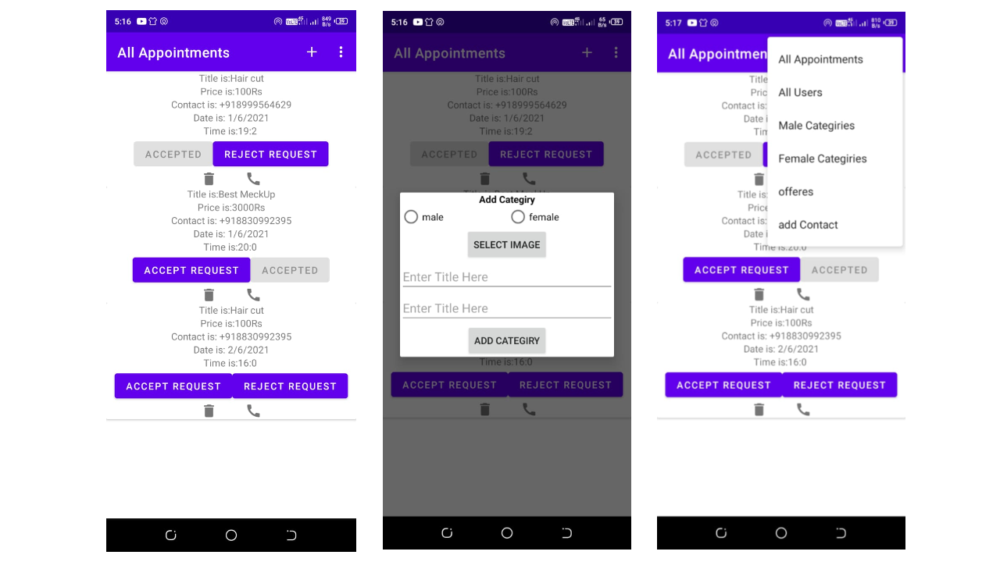
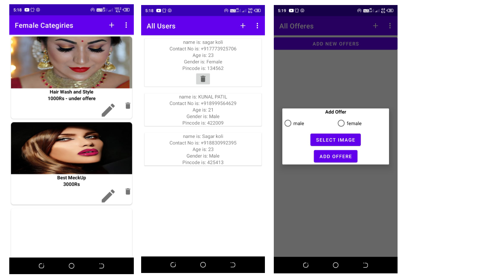

# SMART SALON APP DOCUMENTATION
## User App
### How to Start , Register and Login Dateils In Application


###### Photo information :
```
1. first Your phone are connected to internet your phone are not connect internet your are not able to 
enter this app.
2. your are already registrated the application you can login this app anther Your are not register your 
can register first.
3. you can enter first time this app your can regitration first.
4. you can skip the every step you can enter main screen but your are not able to handle for
all services.

```

### How to booking Appointment


###### choose your self:
```
1. Fist This application are chaking a Gender your are male so first this is showing all male services.
2. this application divide two service male and female.
3. you can clicking any service like hair cut ect. to enter your sedule screen your can select time and
date are complsory entered to click the book now button to book appointment.
4.view appointment in side menu section and click my appointment and get your see your appointments.
5.your can book your first appointment your can see your status are pending to don't worry admin or
manger are see the request and accepting or rejecting as per avalability.

```

### Side Menu Intro


###### side menu opetions
```

 1.you can click service and see this content selected content.
 2.you can logout using side bar.
 3.your are login using guest or skip opetion and you are login your all info to logout the guest
 and login and register your original account.

```

## Admin App
### intro screen Dateils In Application


###### intro screen :
```
1.you can seen open app see all appointments are showing.per appoint are perfoming some task
    a) accept request
    b) reject request
    c) delet request
    d) call user or custumer

2.Your can categiry using the plus icon click this icon to add categiry
        ***male and female option selection is more importent***

3.see the three dots and click here to showing all item lists so you can click the every item
and see this item related content and use all admin services like.
    EDIT,DELET,ACCEPT,REJECT,CALL,UPDATE DATA,UPDATE ADDRESS ETC.

```
### see some admin images


###### intro screen :
```
1.you can seen first images for female categories you can edit categiry and delet category
and so add categiry to user plus button
and apply offere also

2.second image are showing add offere add offere

```
## NOTES
### !please follow this step to get perfection for this app You can see any male and female option dialog to choose correct option.
### click any button make some Paitions;